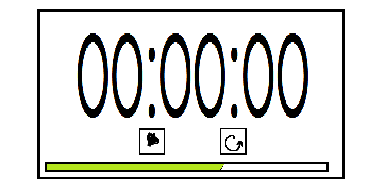

# Project 7B: Build a React Timer App using TypeScript with Test-driven Development
Works as both countdown timer and stopwatch. If a user input is provided it decreases the progress bar until 0 is reached. if all inputs are 0 it counts up and acts as a stopwatch.

## Final Demo:

## Original Mock: 

